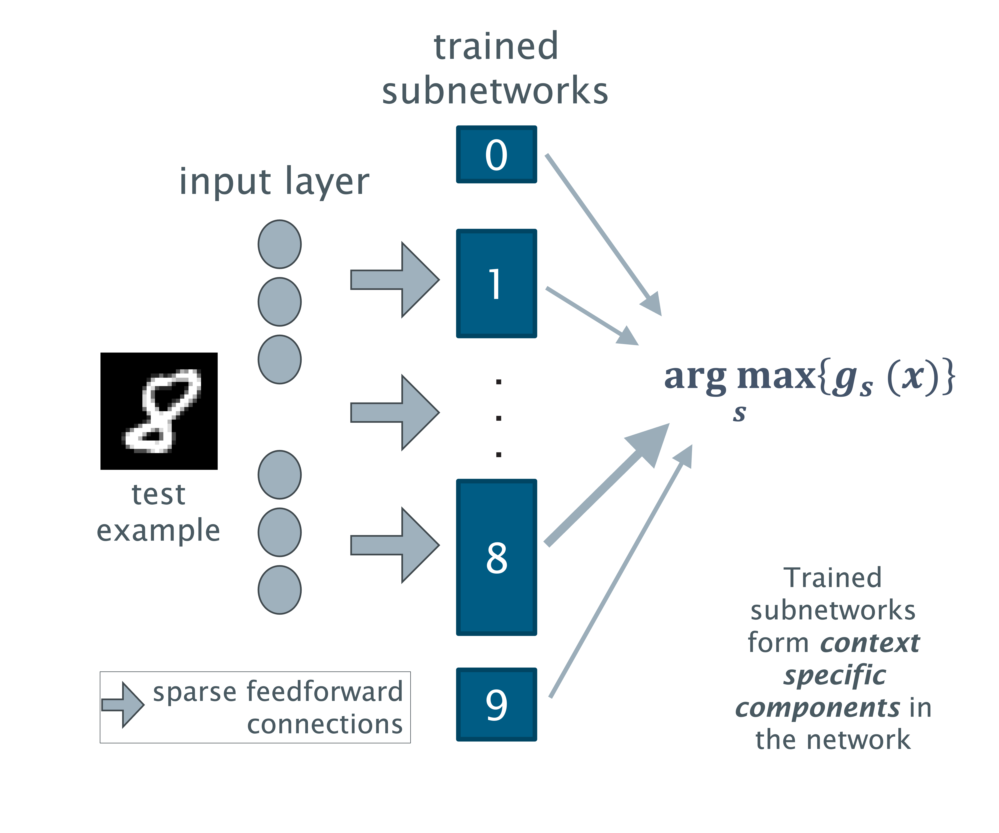

<p style="text-align: center">
  Access this paper: 
  <a href="">IEEE Proceedings of NICE 2025</a>
    |
  <a href="">University of Southampton ePrints (link to be added)</a>
</p>

# Dedicated Class Subnetworks for SNN Class Incremental Learning

Katy Warr ([github](https://github.com/katywarr), [email](email:k.s.warr@soton.ac.uk)), 
Jonathon Hare ([github](https://github.com/jonhare), [email](email:j.s.hare@soton.ac.uk))
and David Thomas ([email](email:d.b.thomas@soton.ac.uk)) 

_Electronics and Computer Science, University of Southampton_

## About

This repository contains code to support our paper 'Dedicated Class Subnetworks for Spiking 
Neural Network (SNN) Class Incremental Learning (CIL)'. In this paper, we explore the hypothesis that 
low power CIL can be achieved through independently trained class-specific subnetworks with 
_no_ subnetwork interaction during training.

### What is Class Incremental Learning?

In most machine learning, the distribution of the training data is assumed to be Independent and Identically Distributed
(IID). Therefore, as training examples are presented to the algorithm, 
they re-enforce the learning of previously presented
similar examples, essentially providing ‘reminders’ to the model.

Class Incremental Learning (CIL) is a type of continual learning where 
training data is grouped sequentially according to class, and 
classes are learnt incrementally. This is more representative of real-life edge learning scenarios where the data is not
IID. CIL is difficult because the training data does not incorporate reminders of previously learnt classes. 

### Approach

Our paper presents an unconventional learning strategy  designed to favour CIL scenarios, whereby an independent
subnetwork is reserved for the separate training of each class.

Here's an abstract depiction of the trained classifier.



The network is entirely feedforward and uses simple neural dynamics. It comprises a set of trained 
subnetworks - one for each class. The test prediction is established based on the network with the 
most neural activity.

Critically, each of the subnetworks is learnt entirely independently. This lack of inter-class competition 
during learning reduces the accuracy of the trained network (we managed just over 85%) but has the advantage that 
the accuracy is unaffected by the order in which the training example classes are presented.

The code presented is a matrix based implementation written to run efficiently on conventional hardware. Functionally 
equivalent Spiking Neural Network (SNN) implementation could run in a neuromorphic setting.

## Problem and Network Definitions

See the paper for details. Here are the descriptions of the dictionaries that are required to define each test.

### Problem Space

The problem space describes the data that will be generated. The keys in the problem space dictionary are:

* `dataset`: The name of the openml dataset to use. For example, `mnist_784` or `fashion-MNIST`. The number of features `n` in **Table 1** in the paper is derived from the data.
* `precision_required`: The number of possible discrete values excluding zero that can be assigned to a feature. This is `d-1`in **Table 1** in the paper.
* `trains_per_class`: The number of training examples from each class.
* `tests_per_class`: The number of test examples from each class.
* `trains_in_test_set`: Include the training examples in the test data. Usually this should be false, but it is useful for checking for overfitting.
* `training_labels`: Set to `None` to include data examples across all the labels during training. To just train a subset of networks, provide the labels as a list. For example: `['0','8']`.
* `testing_labels`: Set to `None` to include data examples across all the labels during test. To just test a subset of networks, provide the labels as a list. For example: `['0','8']`.
* `shuffle`: Set to `False` for class incremental learning. Set to `True` to shuffle the training data. Note that this makes no difference to the test results as the subnetworks learn independently.
* `use_edge_detection`: Set to `True` to incorporate a Prewitt edge detection step into the pre-processing. **Note that this was not explored in the paper.** 

### Network Hyperparameters
These are the keys in the hyperparameter dictionary required to describe a network's learning behaviour. Refer to 
the paper (specifically to `Table 1`) for further details.

| Dictionary Key in the code | Hyperparameter in the paper `Table 1`| 
|----------------------------|--------------------------------------|
| `learning_pool_size`       | $h$                                  |
| `f_h_sparsity`             | $c_{init\_sparsity}$                 |
| `h_threshold_mean`         | $\Theta_\mu$                         |
| `h_threshold_sd`           | $\Theta_\sigma$                      |
| `h_weights_init`           | $w_{init}$                           |
| `h_weights_p`              | $w_p$                                |
| `h_weights_d`              | $w_d$                                |
| `novelty_threshold`        | $r$                                  |
| `noise_tolerance_ratio`    | $w_{noise\_ratio}$                   | 
| `p_init`                   | Static as 0.5                        |
| `p_potentiate`             | $p_p$                                |
| `p_deprecate`              | $p_d$                                |
| `p_mature_threshold`       | Static as 1.0                        | 
| `replenish_learning_pool`  | 1 Set to 0 for `VIII-A` in the paper | 

## Environment Set-up

The project requires the following packages:

* Python 3.12
* numpy 
* pandas
* matplotlib
* seaborn
* openpyxl
* scikit-learn
* jupyterlab

Package management is accomplished using the [uv](https://docs.astral.sh/uv/) tool which will need to be available on
your local workstation. As explained in [the official uv documentation](https://docs.astral.sh/uv/getting-started/installation/),
a number of straightforward installation options are available (including Homebrew).  
  
After the first clone of this repository run the following command in the root directory. It will automatically create
a new virtual environment in the folder .venv and install all required project dependencies to it.  

```shell
uv sync
```

### Running Jupyter Lab

The Jupyter notebooks are in the `examples` folder. Following `uv sync`, navigate to this folder and run Jupyter lab as follows.

```shell
cd examples
uv run jupyter lab
```

Alternatively, the virtual environment will include a Python 3 runtime at the version specified in the `.python-version` 
file in this
directory. Activate the virtual environment in your current terminal as follows and with the virtual environment active, 
Jupyter can be started by switching to the `examples` folder and running the command `jupyter lab`:

```shell
source .venv/bin/activate
cd examples
jupyter lab
```


## Running the Code

Use the Jupyter notebooks in the `examples` directory to get started.

### Plot `Figure 2` and `Figure 3` from the paper

To just plot `Figure 2` and `Figure 3` from the paper, use `4 - Plot Multiple Networks` and `3 - Plot Saved Network`, 
respectively. By default, these notebooks will use the pre-saved data from the paper's experiments, so there is 
no need to run the other notebooks.   

### Training and Testing a Single Network

To train, test and explore single networks:

* `1 - Generate Data.ipynb`: Generates and stores training and test data according to specified criteria.
This ensures that the same data is used for multiple tests.
* `2 - Train, Test, Save Network.ipynb`: Trains a network according to a defined characterisation and using
pre-saved data, tests the network and displays the results. The network and results can be saved for use by 
`3 - Plot Saved Network`
* `3 - Plot Saved Network` will read in your pre-run network and plot graphs similar to those in `Figure 3`.

### Running Multiple Scenarios and Simulations for Comparison 

Generate data using `1 - Generate Data.ipynb`. The `src/simulations/run_simulations` script runs many simulations 
with different networks using the same data. Results and networks are stored in the `simulation_results` folder.

When you have the results, you can use the notebook `3 - Plot Saved Network` to examine a single network and its 
predictions or  `4 - Plot Multiple Networks` to explore variations across the networks.


